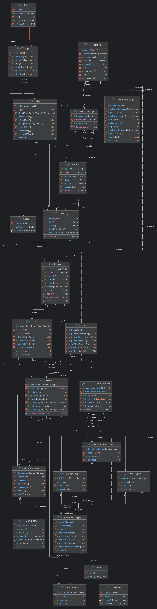

# INF112 Project – *BLOCK-PAIN!*

### Amateur Alliance *(Gruppe 2)*

#### Team:

* Ivar (`CEO`)
* Sander (`CFO`)
* Mats (`Kundekontakt`)
* Ine (`Testansvarlig`)

## Om spillet

> “Du må rømme fra en stadig mer aktiv vulkan. Lavaen stiger gradvis så tiden er knapp. Klarer du å unnslippe?“

## Kjøring

* Kjør Main i din IDE eller kjør med cmd
  `mvn exec:java`.
  Når du kjører programmet burde du få opp startskjermen der det står "Block-Pain", hvis ikke kan det hende du må
  compile programmet med `mvn compile`
  du kan også kjøre og compile det samtidig ved å trykke her ==> `mvn compile exec:java` (kan hende du må skrive det i
  terminalen).
* Spillet burde være kompatibelt med de fleste operativsystemer

## Kjente feil

Ingen som vi vet om

## Viktige lenker

[Semesteroppgave krav](https://git.app.uib.no/inf112/24v/inf112-24v/-/wikis/prosjekt/semesteroppgave)

[Møtereferat](https://docs.google.com/document/d/10a05Fu1_dx0Y_XaLF6ZEFuFKvsOZK4iNWEVNr36HerU/edit)

[Trello issue board](https://trello.com/b/zh9J5B3W/board)

[libGDX og maven template](doc/libGDX+Maven.md)

[Planlegging av spill](https://docs.google.com/document/d/1aa2oW-XstsS6mD0cP296_O31NZNTnafWvksUJrwbtmI/edit)

## Credits

[Inspirasjon for ScreenManager](https://happycoding.io/tutorials/libgdx/game-screens#the-libgdx-approach)

[Lava tileset](https://assetstore.unity.com/packages/2d/textures-materials/grotto-escape-ii-86689)

Bildene for title- og gameover screen er [generert av AI](https://www.bing.com/images/create)
og [redigert videre](https://picfont.com/) av Ine.

## Teknisk beskrivelse
Top down 2d spill, der man beveger spilleren enten ved bruk WASD eller piltastene for å navigere et labyrint-lignende kart. Kartet har hindringer i form av steiner som kan dyttes, og en stadig stigende lava. Underveis er det mulig å plukke opp powerups (en hammer) som gjør det mulig å knuse vegger. Dersom lavaen treffer spilleren dør man, og får game over. Dersom man når toppen av kartet vinner man.

Prosjektet vårt er kodet i Java, og vi har tatt utgangspunkt i LibGDX frameworket. For prosjektorganisering og versjonskontroll har vi brukt GitLab som er basert på Git. Maven er brukt for testing (mockito, osv), kjøring og kompilering av prosjektet. IntelliJ er brukt for å sjekke test coverage, og generere klassediagram. 

TLDR forklaring for klassediagrammet:
`/doc/ `holder styr på alle oblig innleveringene 
`/src/main/resources` inneholder alle lydeffekter, bilder, osv
`/src/main/java/inf112/skeleton/app/assets` holder styr på lydeffekter, og tiles + flags
`/src/main/java/inf112/skeleton/app/screens/ScreenManager.java`, holder styr på alle de ulike skjermene (og indirekte gamestaten) slik at man kan bytte mellom dem. Disse er: `TitleScreen`, `InfoScreen`, `GameScreen`, `WinScreen`, `GameOverScreen`. 
`/src/main/java/inf112/skeleton/app/world` inneholder alle klassene som påvirker selve spillet.
`/src/main/java/inf112/skeleton/app/AmateurInput.java` inneholder all logikk for spiller bevegelse
`/src/main/java/inf112/skeleton/app/CameraController.java` inneholder all logikk for spill kamera

